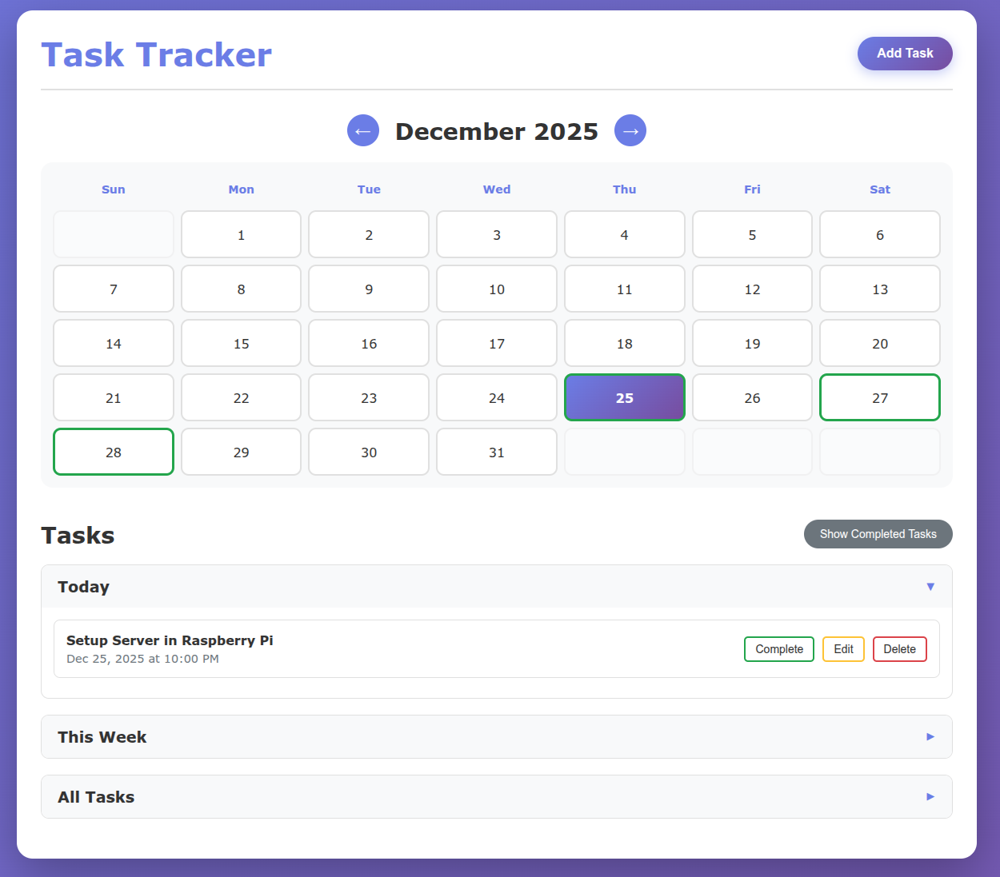

# Task Tracker

A web-based lightweight task tracker with user authentication and privilege management. Perfect for households or small teams where you need to track tasks with different visibility levels.

Add tasks (optionally with a date), mark them done, and delete them when they're no longer needed.

Run this on a raspberry pi or your home server and everyone in the house can track their chores.

## Features

- **User Authentication**: Login and registration system with session management
- **Admin Privileges**: First user automatically becomes admin; subsequent users require admin approval
- **Task Visibility**: Admins can create tasks with different visibility levels (All users, Admins only, Private)
- **Calendar View**: Monthly calendar with navigation arrows to view different months
- **Task Management**: Add, edit, delete, and mark tasks as complete
- **Date-based Organization**: Tasks are organized by today, this week, and remaining
- **Completed Tasks**: View and restore completed tasks (auto-deleted after 1 month)
- **Day View**: Click on any calendar day to see all tasks for that day
- **Task Creator Tracking**: Every task shows who created it
- **Admin Dashboard**: Manage users, approve account requests, and change user roles



## Start the application (HTTPS locally)

On a Raspberry Pi or anywhere you want to host the server, install `mkcert` and run the startup script.
This will automatically create a virtual environment, install dependencies, generate a local HTTPS
certificate, and start the server over HTTPS.

```bash
./start_server.sh
```

The script will:
- Create a Python virtual environment (if it doesn't exist)
- Install all required dependencies from `requirements.txt`
- Generate and trust a local HTTPS certificate (via `mkcert`)
- Start the Flask server with HTTPS

### Install mkcert
Follow the official instructions for your OS: https://github.com/FiloSottile/mkcert

## Access the application:
   - **On the same device**: Open your browser and navigate to:
     ```
     https://localhost:5001
     ```
   
   - **From other devices on the same WiFi network**: You can access the application from any phone or PC on the same network using:
     - **IP Address**: `https://[device-ip-address]:5001` (e.g., `https://192.168.1.100:5001`)
     - **Hostname**: `https://[hostname]:5001` (e.g., `https://raspberrypi.local:5001`)
   
   - **Raspberry Pi**: If running on a Raspberry Pi, it typically has `raspberrypi` as the hostname, so you can access it using:
     ```
     https://raspberrypi.local:5001
     ```

The startup script generates a certificate for `localhost`, your machine hostname, and the first LAN IP it detects.
If your LAN IP changes, delete `.certs/` and re-run the script to regenerate the cert.

## Hosting on Railway
Railway terminates HTTPS for you, so you should run the app without TLS there.
Set `APP_USE_TLS=false` and bind to `0.0.0.0` (Railway defaults are fine).

## Make it an iPhone or an Android (PWA) app

For iPhone,
- Open the website on Safari
- Tap the 3 dots on the bottom of the page and "Share"
- Navigate to and tap "Add to Home Screen" 

For Android,
- Open the website on Chrome
- Tap the 3 dots on the top of the screen and "Add to Home Screen"

## User Accounts and Privileges

### First User (Admin)
**Important**: The first user to register will automatically be created as an admin account. This admin account has full privileges and can manage all other users.

### Account Creation
- After the first admin account is created, all subsequent account registrations require admin approval
- New users will see a message that their account request is pending approval
- Admins will see a notification banner when there are pending account requests
- Admins can approve new accounts as either:
  - **Admin**: Full privileges (can edit/delete all tasks, manage users)
  - **Regular User**: Limited privileges (can only view and add tasks)

### User Roles

#### Admin Users
- Can view all tasks (including tasks created by regular users)
- Can add, edit, delete, and mark any task as complete
- Can set task visibility when creating/editing:
  - **All users**: Visible to everyone
  - **Admins only**: Only visible to admin users
  - **Private**: Only visible to the creator
- Can access Admin Dashboard to:
  - Approve/reject account requests
  - View all users
  - Change user roles (admin ↔ regular user)
  - Delete users

#### Regular Users
- Can view tasks with visibility "All users" and their own tasks
- Can add new tasks (always created with "All users" visibility)
- Cannot edit, delete, or mark tasks as complete
- Cannot change task visibility

### Task Visibility
- **All users**: Visible to everyone (default for regular users)
- **Admins only**: Only visible to admin users
- **Private**: Only visible to the task creator
- Regular user tasks are always visible to admins for oversight purposes

## Usage

- **Login/Register**: Start by creating an account (first user becomes admin automatically)
- Click "Add Task" button to add a new task
- Tasks can have an optional date and time
- Admins can set task visibility when creating/editing tasks
- Tasks with dates appear on the calendar
- Click on a calendar day to view tasks for that day
- Mark tasks as complete to remove them from the active list (admins only)
- Use "Show Completed Tasks" to view and restore completed tasks
- Edit or delete tasks using the action buttons (admins only)
- Click on your avatar (top right) to access user menu:
  - View username
  - Access Admin Dashboard (admins only)
  - Logout

## Database

The application uses SQLite database (`tasks.db`) which is automatically created on first run. The database includes:
- **Users table**: Stores user accounts with authentication and role information
- **Account requests table**: Stores pending account registration requests
- **Tasks table**: Stores tasks with creator information and visibility settings

Completed tasks are automatically deleted from the database after 1 month.

### Database Schema
- Tasks include `created_by` field to track who created each task
- Tasks include `visibility` field to control who can see each task
- All tasks show the creator's username in the task list

